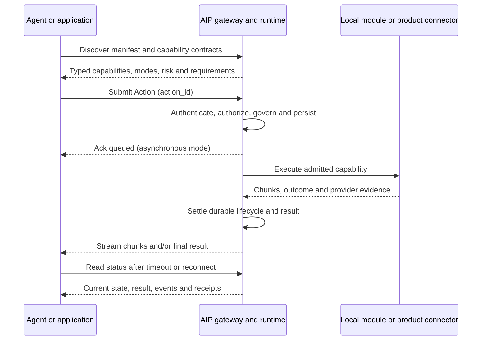
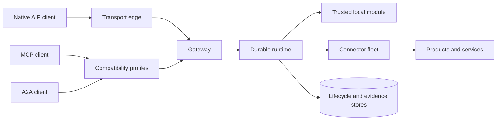

<!-- markdownlint-disable MD013 MD026 MD033 MD041 MD060 -->

<div align="center">

# Agent Interoperability Protocol

**One protocol for every agent.**

Connect autonomous agents, tools, and services through a shared protocol—and turn isolated intelligence into one coordinated, AI-native company.

[](https://github.com/getaip/core/releases/latest) [](https://www.npmjs.com/package/getaip) [](https://getaip.org/docs/spec/aip-1.0) [](https://getaip.org/docs/getting-started/installation) [](https://github.com/getaip/core/blob/main/LICENSE)

[**Install GetAIP →**](#install-getaip) · [Documentation](https://getaip.org/docs/) · [AIP 1.0 specification](https://getaip.org/docs/spec/aip-1.0) · [Connector directory](https://getaip.org/connectors/)

</div>

---

<details>
<summary><strong>Explore this README</strong></summary>

- [Why AIP](#your-agents-can-think-aip-lets-them-work-as-one-company)
- [Connect, coordinate, and scale](#connect-coordinate-scale)
- [Install GetAIP](#install-getaip)
- [Follow one recoverable action](#one-action-one-identity-one-recoverable-history)
- [Explore the protocol surface](#built-for-work-that-changes-the-real-world)
- [Choose an integration edge](#one-semantic-core-every-integration-edge)
- [Browse product connectors](#connect-the-products-your-company-already-runs-on)
- [Understand the architecture](#architecture-with-explicit-ownership)
- [Review trust and release integrity](#trust-is-a-chain-of-narrow-decisions)
- [Build from source](#build-getaip-core-from-source)
- [Navigate the repository](#repository-guide)
- [Contribute](#contributing)

</details>

## Your agents can think. AIP lets them work as one company.

AI agents are excellent at reasoning inside a conversation. Real companies run on work that crosses boundaries: a sales agent updates a CRM, an operations agent launches a workflow, a support agent hands a conversation to a person, and a finance agent changes state in a system another team owns.

The difficult part is not sending the first request. It is keeping the work understandable after that request leaves the original process.

- What can the other system actually do?
- Who is acting, for which tenant, and with whose authority?
- Does this action require approval?
- Is it safe to retry after a timeout?
- Where is the work now?
- What happened after the connection disappeared?
- Which result and evidence belong to the original intent?

AIP gives agents, applications, tools, and services a shared contract for answering those questions. Capabilities are discoverable. Work has a stable identity. Policy is applied before execution. Long-running state remains observable. Results, events, receipts, and audit records stay correlated after the initiating connection is gone.

That is the difference between a collection of tool calls and a coordinated AI-native organization.

| A raw call gives you | AIP adds around the work |
|---|---|
| An endpoint and a payload | Discoverable capabilities with typed inputs, outputs, and declared contracts |
| A connection-level identity | Explicit principals, tenant context, delegated authority, and trusted ingress boundaries |
| A response or a timeout | A durable action lifecycle that can be queried after reconnecting |
| Ad hoc retry logic | Declared idempotency, replay, transaction, and reconciliation behavior |
| Approval in a separate workflow | Approval as a durable, verified state of the same action |
| Service-local logs | Correlated results, events, receipts, callbacks, and audit views |

> **AIP does not replace your agents. It gives them a reliable way to work across systems.**

## Connect. Coordinate. Scale.

| 01 / Connect | 02 / Coordinate | 03 / Scale |
|---|---|---|
| Bring agents, applications, tools, services, and data into one discoverable network. | Give every participant the same language for identity, authority, actions, lifecycle, results, and evidence. | Add workflows, products, and independently operated participants without inventing a new coordination model for every integration. |

### Discover before you invoke

Participants publish manifests and typed capabilities. A caller can inspect schemas, supported execution modes, side effects, approval rules, credential requirements, retry behavior, transactions, compensation, and declared limits before anything changes.

### Govern before you execute

The trusted edge establishes the actor. The gateway binds deployment-owned identity and tenant context. The runtime validates the capability contract, authorization, idempotency, approval, and transaction state before choosing an admitted handler.

### Follow the action, not the connection

Every action has a stable `action_id`. The request can time out, a client can restart, or a stream can reconnect without erasing the identity of the work. Authorized callers can read the latest status, result, events, or receipts instead of guessing whether to create new work.

### Recover from facts

AIP distinguishes message replay, repeated business intent, worker leases, connector routes, and uncertain provider outcomes. When an external mutation may have committed, the safe answer can be “reconcile” rather than “retry blindly.”

## Install GetAIP

Connect GetAIP to Codex in one command:

```sh
npx getaip setup --codex --global
```

The setup launcher installs the signed GetAIP native distribution, creates the local loopback configuration, and configures the selected client to use the verified GetAIP MCP server.

Choose the client you already use:

| Client | User-global setup |
|---|---|
| Codex | `npx getaip setup --codex --global` |
| Claude Code | `npx getaip setup --claude --global` |
| Cursor | `npx getaip setup --cursor --global` |
| Gemini CLI | `npx getaip setup --gemini --global` |
| OpenCode | `npx getaip setup --opencode --global` |

Configure more than one client at once:

```sh
npx getaip setup --codex --claude --global
```

Prefer project-local configuration? Run setup from the project root and replace `--global` with `--project`.

Preview the signed plan and every proposed client change before writing anything:

```sh
npx getaip setup --codex --global --dry-run
```

<details>
<summary><strong>Installation requirements and verification</strong></summary>

The signed distribution currently supports macOS and Linux on ARM64 and x64. It requires Node.js `22.14.0` or newer with npm and `npx`. Do not run setup with `sudo`.

The npm package is a small verified launcher, not a general JavaScript SDK. During setup it selects the platform-native artifact, verifies the Ed25519-signed release manifest against its embedded trust store, limits downloads to approved release locations, checks the artifact size and SHA-256 digest, and only then runs native setup.

Pin the reviewed release when reproducibility matters:

```sh
npx getaip@2.1.0 setup --codex --global
```

[Read the complete installation and rollback guide →](https://getaip.org/docs/getting-started/installation)

</details>

## One action, one identity, one recoverable history

An AIP action is one identifiable unit of work another participant agrees to perform. The action ID connects the original intent to every later state and result.



The immediate response depends on the capability and mode:

- **Synchronous** work returns an `ActionResult` inline.
- **Asynchronous** work normally returns an acknowledgement and continues through a durable queue.
- **Streaming** work emits ordered chunks and still settles in a terminal result.
- **Approval-gated** work pauses as the same governed action until verified authority advances it.
- **Transactional** work can separate planning, commit, reconciliation, compensation, and other declared recovery behavior.

The connection is temporary. The action identity is not.

## Built for work that changes the real world

| Capability | What it gives an agent system |
|---|---|
| **Capability discovery** | Manifests, resources, typed schemas, supported profiles, contracts, limits, and security metadata |
| **Identity and trust** | Principals, signed envelopes, authenticated-edge context, tenant binding, credential references, and delegation chains |
| **Durable actions** | Stable IDs, synchronous/asynchronous/streaming modes, acknowledgements, lifecycle views, results, and retention |
| **Approvals and policy** | Durable approval requests, verified decisions, separation of duties, frozen policy context, and safe resume |
| **Idempotency and replay safety** | Separate fences for duplicate messages, repeated intent, stale workers, callbacks, routes, and provider operations |
| **Transactions and recovery** | Dry run, planning, commit ownership, provider checkpoints, unknown outcomes, reconciliation, and compensation |
| **Delegation** | Explicit child actions, bounded authority, cycle checks, peer routes, durable outboxes, and correlated results |
| **Streaming and callbacks** | Ordered stream chunks, reconnectable cursors, asynchronous callbacks, delivery state, and terminal settlement |
| **Cancellation** | Governed cancellation requests tied to the same action while preserving committed history and provider truth |
| **Evidence and audit** | Events, receipts, transaction views, approval records, scoped audit queries, and explainable operational history |

AIP deliberately keeps declarations and evidence separate. A capability contract says what a participant claims and what a runtime can validate; conformance and qualification determine what an exact implementation or deployment has proved.

## One semantic core. Every integration edge.

AIP has one native action and lifecycle model. Transports move that model. Compatibility profiles project existing client protocols onto it. Product connectors translate admitted capabilities into provider-specific behavior.

| Surface | Use it when | What stays consistent |
|---|---|---|
| **Native AIP** | You need the complete envelope, capability, action, lifecycle, governance, and evidence model | Native AIP semantics end to end |
| **Rust SDK** | A Rust application needs AIP types and implementation components directly | Typed models and selected product-neutral runtime features |
| **MCP compatibility** | An existing MCP client needs an AIP-backed tool surface over stdio or Streamable HTTP | Calls map into native capabilities and actions; MCP remains the client edge |
| **A2A compatibility** | An A2A 1.0 client needs Agent Card discovery, tasks, subscriptions, or push notifications | A2A tasks project onto the governed native lifecycle |
| **Native transports** | You need HTTP, NATS, SSE, or WebSocket delivery behavior | Transport changes delivery, not action meaning |
| **Signed webhooks** | A product sends events into the organization | Provider events enter through an authenticated, time-bounded profile |
| **Product connectors** | An existing product API must become a bounded capability surface | Product DTOs and credentials stay at the provider boundary |

MCP and A2A are not replaced by AIP. They become supported edges into the same governed lifecycle when their projection matches what the client needs.



[Choose the right integration surface →](https://getaip.org/docs/concepts/profiles-and-connectors)

## Connect the products your company already runs on

GetAIP keeps product-specific code and credentials outside the product-neutral daemon. Each standalone connector host exposes a bounded, typed capability catalogue for one admitted product boundary.

| Connector | What agents can finish through the boundary |
|---|---|
| **[Cal.diy](https://getaip.org/docs/connectors/cal-diy)** | Discover availability; reserve slots; create, reschedule, and cancel bookings; work with schedules, calendars, conferencing, and signed events |
| **[Hermes Agent](https://getaip.org/docs/connectors/hermes-agent)** | Discover endpoints and models; run chat and responses; manage durable runs, sessions, approvals, jobs, operator work, streaming, and governed delegation |
| **[Chatwoot](https://getaip.org/docs/connectors/chatwoot)** | Manage customer conversations, messages, contacts, teams, automation, status, human handoff, and authenticated webhook events |
| **[Dify](https://getaip.org/docs/connectors/dify)** | Invoke published apps and workflows; manage conversations, files, and knowledge data; stream output; cancel retained tasks; handle human input |
| **[CrewAI](https://getaip.org/docs/connectors/crewai)** | Run deployment-admitted crews; follow ordered events; observe, cancel, batch, replay, train, test, query knowledge, and reset explicit memory domains |
| **[Twenty](https://getaip.org/docs/connectors/twenty)** | Query and mutate standard or custom CRM records; manage selected workspace metadata; inspect OpenAPI documents; consume signed webhook events |

Your product is not listed? Build a connector that exposes only the operations agents should be allowed to discover and invoke—without adding provider-specific objects to the AIP semantic core.

[Browse the connector catalog](https://getaip.org/docs/connectors) · [Build a connector](https://getaip.org/docs/guides/build-a-connector) · [Run the connector-fleet quickstart](https://getaip.org/docs/getting-started/connector-fleet-quickstart)

## From one agent to an AI-native organization

AIP is useful wherever independently operated participants share consequential work:

- **Revenue operations:** discover a valid slot, book a meeting, update a CRM record, and retain one traceable lifecycle across the workflow.
- **Customer support:** turn an authenticated message event into a governed action, respond through Chatwoot, and pause for human handoff without losing context.
- **Business operations:** start a Dify workflow or Hermes operator, stream progress, collect approval, and recover the same run after reconnecting.
- **Multi-agent execution:** invoke an admitted CrewAI crew or delegate a child action while preserving caller, authority, correlation, and result boundaries.
- **Sensitive mutations:** require approval, idempotency, provider checkpoints, and reconciliation before repeating work whose outcome is uncertain.
- **Cross-team platforms:** give separately owned agents and services one contract without forcing them to share an agent framework, model, database, or internal reasoning.

Use a direct API call when one owner controls both sides, the operation is short and harmless to repeat, and the existing interface already provides an unambiguous durable lifecycle. AIP earns its place when uncertainty, authority, or recovery matters.

## Architecture with explicit ownership

GetAIP Core is a Rust reference implementation and runtime for AIP. Its architecture separates semantic meaning, ingress, central governance, product execution, fleet control, and durable evidence so that no component silently gains authority it does not need.

| Boundary | Owns | Does not own |
|---|---|---|
| **Semantic core** | IDs, envelopes, messages, capabilities, actions, results, and pure validation | Networking, persistence, deployment policy, or product behavior |
| **Transport and profiles** | Native framing plus bounded MCP, A2A, streaming, and webhook mappings | Capability authorization or a parallel action store |
| **Gateway** | Authenticated actor, trusted identity context, replay checks, authorization, and dispatch | Provider credentials or external product truth |
| **Runtime** | Lifecycle, queues, approvals, transactions, callbacks, events, receipts, retention, and recovery | Arbitrary provider routes or secrets |
| **Connector fleet** | Tenant-scoped catalog, immutable route assignment, signed remote dispatch, host execution, and result return | Self-admission or caller-selected provider accounts |
| **Persistence and evidence** | In-memory, file-backed, or PostgreSQL runtime state; registry state; host checkpoints; retained release evidence | Claims beyond the exact artifact, topology, and procedure recorded |

A small trusted deployment can run local modules with file-backed state. A clustered deployment can use shared PostgreSQL state and separately operated connector hosts. NATS is optional and only required when the native NATS transport is enabled.

[Explore the complete architecture →](https://getaip.org/docs/architecture/overview)

## Trust is a chain of narrow decisions

Agent systems become dangerous when identity, authority, retries, credentials, and external outcomes are all treated as one implicit “trusted call.” GetAIP keeps those decisions separate.

- **Authentication is not authorization.** A signed envelope or authenticated transport proves an immediate actor under the configured edge; capability and object policy still decide what that actor may do.
- **Tenant and account selection come from trusted state.** Caller-controlled fields cannot silently choose another tenant, connector instance, credential, or provider origin.
- **Secrets stay behind opaque handles.** Raw product credentials remain at the connector or deployment boundary instead of entering actions, manifests, errors, metrics, or audit records.
- **Replay is fenced at multiple layers.** Message IDs, idempotency keys, worker leases, connector routes, callback deliveries, and provider operations solve different duplicate-delivery problems.
- **Uncertainty is explicit.** A provider timeout after a mutation can become an unknown outcome that requires reconciliation—not an unsafe automatic retry.
- **Evidence stays scoped.** A receipt, signature, test, or successful controlled run proves only the artifact, boundary, and procedure it actually covers.

The public setup path also verifies the release before execution: signed manifest, trusted key, approved release origin, bounded artifact size, and SHA-256 identity.

[Read the security model](https://getaip.org/docs/architecture/security-model) · [Verify the 2.1.0 release](https://github.com/getaip/core/releases/tag/v2.1.0) · [Report a vulnerability privately](https://getaip.org/docs/project/security)

## AIP is the contract. GetAIP is the implementation.

| Project layer | Current role |
|---|---|
| **AIP 1.0** | The versioned protocol: native objects, message semantics, lifecycle, profiles, schemas, and conformance requirements |
| **GetAIP Core** | The maintained Rust implementation: gateway, runtime, storage, transports, profiles, connector fleet, CLI, examples, and test tooling |
| **GetAIP 2.1.0** | The current signed native distribution for macOS and Linux |
| **`getaip` on npm** | The small public launcher that verifies and installs the correct native release and configures supported clients |

“Implemented,” “conformant,” “qualified,” and “live verified” are intentionally different claims in this project. Source code and deterministic tests show that behavior exists; they do not automatically qualify a rebuilt artifact, changed provider, or target production deployment.

[Check implementation status](https://getaip.org/docs/reference/implementation-status) · [Understand conformance and qualification](https://getaip.org/docs/reference/conformance) · [Read the release](https://github.com/getaip/core/releases/tag/v2.1.0)

## Build GetAIP Core from source

The signed installer is the shortest path for most users. Build from source when you are developing the implementation, reviewing exact code, assembling a connector fleet, or producing a custom artifact.

You need Rust `1.88` or newer:

```sh
git clone https://github.com/getaip/core.git
cd core
git checkout --detach v2.1.0
cargo build --locked --release -p getaip-server -p getaip-cli
```

The resulting binaries are:

```text
target/release/getaip-server
target/release/getaip
```

Run the product-neutral local quickstart with file-backed state, or add PostgreSQL, NATS, the connector control plane, and selected standalone hosts only when your topology requires them.

[Install or build GetAIP](https://getaip.org/docs/getting-started/installation) · [Run your first native action](https://getaip.org/docs/getting-started/quickstart) · [Use the Rust SDK](https://getaip.org/docs/guides/use-rust-sdk)

## Repository guide

| Path | Responsibility |
|---|---|
| [`schemas/aip`](https://github.com/getaip/core/tree/main/schemas/aip) | Machine-readable AIP 1.0 schemas |
| [`crates/aip-core`](https://github.com/getaip/core/tree/main/crates/aip-core) | Product-neutral semantic objects and validation |
| [`crates/aip-gateway`](https://github.com/getaip/core/tree/main/crates/aip-gateway) | Trusted ingress, identity, replay policy, authorization, and dispatch |
| [`crates/aip-runtime`](https://github.com/getaip/core/tree/main/crates/aip-runtime) | Actions, queues, approvals, transactions, streaming, callbacks, and recovery |
| [`crates/aip-profile-mcp`](https://github.com/getaip/core/tree/main/crates/aip-profile-mcp) | MCP compatibility mapping |
| [`crates/aip-profile-a2a`](https://github.com/getaip/core/tree/main/crates/aip-profile-a2a) | A2A compatibility mapping |
| [`crates/getaip-server`](https://github.com/getaip/core/tree/main/crates/getaip-server) | Product-neutral daemon composition |
| [`crates/getaip-cli`](https://github.com/getaip/core/tree/main/crates/getaip-cli) | Operator and developer CLI |
| [`crates/aip-connector-*`](https://github.com/getaip/core/tree/main/crates) | Product adapters and shared connector infrastructure |
| [`crates/aip-host-*`](https://github.com/getaip/core/tree/main/crates) | Standalone, product-bounded connector processes |
| [`examples`](https://github.com/getaip/core/tree/main/examples) | Native, MCP, streaming, NATS, connector, and reference workflows |
| [`deploy`](https://github.com/getaip/core/tree/main/deploy) | Reference deployment and qualification topologies |
| [`packages/getaip`](https://github.com/getaip/core/tree/main/packages/getaip) | Public npm setup launcher |

Good places to start reading:

- [`examples/minimal-agent`](https://github.com/getaip/core/tree/main/examples/minimal-agent) for a compact native participant.
- [`examples/getaip-server-mcp`](https://github.com/getaip/core/tree/main/examples/getaip-server-mcp) for an MCP-facing server composition.
- [`examples/restaurant-booking`](https://github.com/getaip/core/tree/main/examples/restaurant-booking) for a multi-step domain workflow.
- [`examples/support-sandbox`](https://github.com/getaip/core/tree/main/examples/support-sandbox) for governed support work.

## Documentation for humans and agents

| Goal | Start here |
|---|---|
| Understand the protocol | [What AIP is](https://getaip.org/docs/getting-started/what-is-aip) |
| Install the signed release | [Installation](https://getaip.org/docs/getting-started/installation) |
| Run one complete action | [Quickstart](https://getaip.org/docs/getting-started/quickstart) |
| Integrate natively | [Use native AIP](https://getaip.org/docs/guides/use-native-aip) |
| Connect an MCP client | [Use AIP through MCP](https://getaip.org/docs/guides/use-aip-through-mcp) |
| Connect an A2A client | [Use AIP through A2A](https://getaip.org/docs/guides/use-aip-through-a2a) |
| Deploy and operate | [Production deployment](https://getaip.org/docs/guides/production-deployment) |
| Investigate failures | [Observe and recover](https://getaip.org/docs/guides/observe-and-recover) |
| Review trust boundaries | [Security model](https://getaip.org/docs/architecture/security-model) |
| Implement the protocol | [AIP 1.0 specification](https://getaip.org/docs/spec/aip-1.0) |

The documentation is also available as [raw Markdown](https://getaip.org/docs/raw/index.md), an [LLM-oriented entry point](https://getaip.org/docs/llms.txt), and a [machine-readable JSON index](https://getaip.org/docs/index.json).

## Contributing

AIP changes must keep implementation, schemas, tests, documentation, and evidence aligned. Start with a focused boundary, run the narrowest relevant checks, and widen validation before requesting review.

- Read the [contribution guide](https://getaip.org/docs/project/contributing).
- Follow the [code of conduct](https://getaip.org/docs/project/code-of-conduct).
- Report security issues privately through the [security policy](https://getaip.org/docs/project/security), not a public issue.
- Use [GitHub Issues](https://github.com/getaip/core/issues) for scoped defects and proposals that are safe to discuss publicly.

## License

GetAIP Core is source-available under the [Business Source License 1.1](https://github.com/getaip/core/blob/main/LICENSE), including the repository's Additional Use Grant and change terms. Review [`NOTICE`](https://github.com/getaip/core/blob/main/NOTICE) and [`THIRD_PARTY_NOTICES`](https://github.com/getaip/core/blob/main/THIRD_PARTY_NOTICES) for the complete distribution boundary.

---

<div align="center">

### Agents work better together.

**Connect intelligence. Coordinate action. Build your AI-native company.**

[Install GetAIP](https://getaip.org/docs/getting-started/installation) · [Explore the docs](https://getaip.org/docs/) · [Read AIP 1.0](https://getaip.org/docs/spec/aip-1.0) · [View GetAIP Core](https://github.com/getaip/core)

[getaip.org](https://getaip.org) · [hi@getaip.org](mailto:hi@getaip.org) · Made in UAE ♥

</div>
